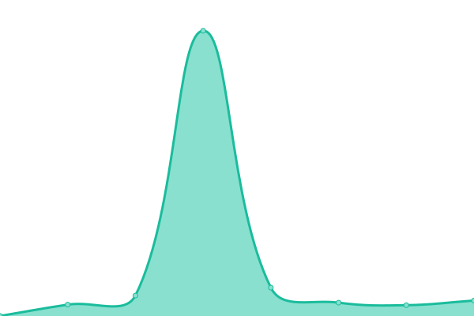
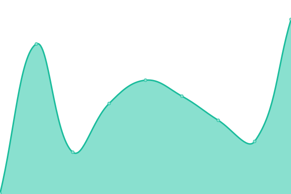
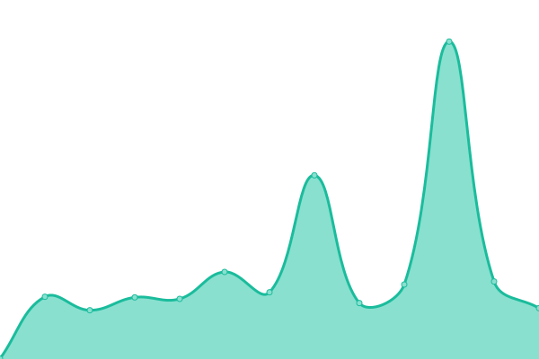

# [📈 Live Status](https://status.redacted-designs.com): <!--live status--> **🟥 Complete outage**

This repository contains the open-source uptime monitor and status page for [Richard Avirett](https://status.redacted-designs.com), powered by [Upptime](https://github.com/upptime/upptime).

With [Upptime](https://upptime.js.org), you can get your own unlimited and free uptime monitor and status page, powered entirely by a GitHub repository. We use [Issues](https://github.com/ravirett/megastor-monitor/issues) as incident reports, [Actions](https://github.com/ravirett/megastor-monitor/actions) as uptime monitors, and [Pages](https://status.redacted-designs.com) for the status page.

<!--start: status pages-->
<!-- This summary is generated by Upptime (https://github.com/upptime/upptime) -->
<!-- Do not edit this manually, your changes will be overwritten -->
<!-- prettier-ignore -->
| URL | Status | History | Response Time | Uptime |
| --- | ------ | ------- | ------------- | ------ |
|  Portainer | 🟥 Down | [portainer.yml](https://github.com/ravirett/megastor-monitor/commits/HEAD/history/portainer.yml) | 

 278ms
     
 | 

<a href="https://ravirett.github.io/megastor-monitor/history/portainer">17.33%</a>
    

|  Minecraft | 🟥 Down | [minecraft.yml](https://github.com/ravirett/megastor-monitor/commits/HEAD/history/minecraft.yml) | 

 0ms
     
 | 

<a href="https://ravirett.github.io/megastor-monitor/history/minecraft">0.00%</a>
    

|  PMS | 🟥 Down | [pms.yml](https://github.com/ravirett/megastor-monitor/commits/HEAD/history/pms.yml) | 

 198ms
     
 | 

<a href="https://ravirett.github.io/megastor-monitor/history/pms">17.33%</a>
    

|  Tautulli | 🟥 Down | [tautulli.yml](https://github.com/ravirett/megastor-monitor/commits/HEAD/history/tautulli.yml) | 

 343ms
     
 | 

<a href="https://ravirett.github.io/megastor-monitor/history/tautulli">0.00%</a>
    

|  Ombi | 🟥 Down | [ombi.yml](https://github.com/ravirett/megastor-monitor/commits/HEAD/history/ombi.yml) | 

 2177ms
     
 | 

<a href="https://ravirett.github.io/megastor-monitor/history/ombi">17.33%</a>
    

|  Sonarr | 🟥 Down | [sonarr.yml](https://github.com/ravirett/megastor-monitor/commits/HEAD/history/sonarr.yml) | 

 307ms
     
 | 

<a href="https://ravirett.github.io/megastor-monitor/history/sonarr">17.33%</a>
    

|  Radarr | 🟥 Down | [radarr.yml](https://github.com/ravirett/megastor-monitor/commits/HEAD/history/radarr.yml) | 

 181ms
     
 | 

<a href="https://ravirett.github.io/megastor-monitor/history/radarr">17.34%</a>
    

|  Jackett | 🟥 Down | [jackett.yml](https://github.com/ravirett/megastor-monitor/commits/HEAD/history/jackett.yml) | 

 316ms
     
 | 

<a href="https://ravirett.github.io/megastor-monitor/history/jackett">17.34%</a>
    

|  Sab | 🟥 Down | [sab.yml](https://github.com/ravirett/megastor-monitor/commits/HEAD/history/sab.yml) | 

 308ms
     
 | 

<a href="https://ravirett.github.io/megastor-monitor/history/sab">17.34%</a>
    

|  QBT | 🟥 Down | [qbt.yml](https://github.com/ravirett/megastor-monitor/commits/HEAD/history/qbt.yml) | 

 0ms
     
 | 

<a href="https://ravirett.github.io/megastor-monitor/history/qbt">0.00%</a>
    

<!--end: status pages-->

[**Visit our status website →**](https://status.redacted-designs.com)

## 📄 License

- Powered by: [Upptime](https://github.com/upptime/upptime)
- Code: [MIT](./LICENSE) © [Richard Avirett](https://status.redacted-designs.com)
- Data in the `./history` directory: [Open Database License](https://opendatacommons.org/licenses/odbl/1-0/)
